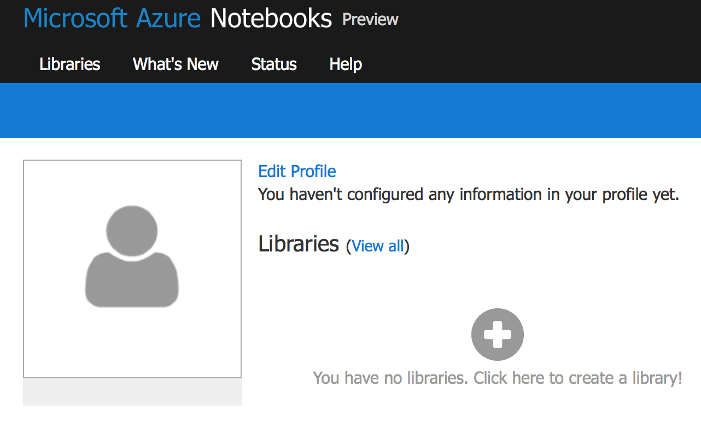
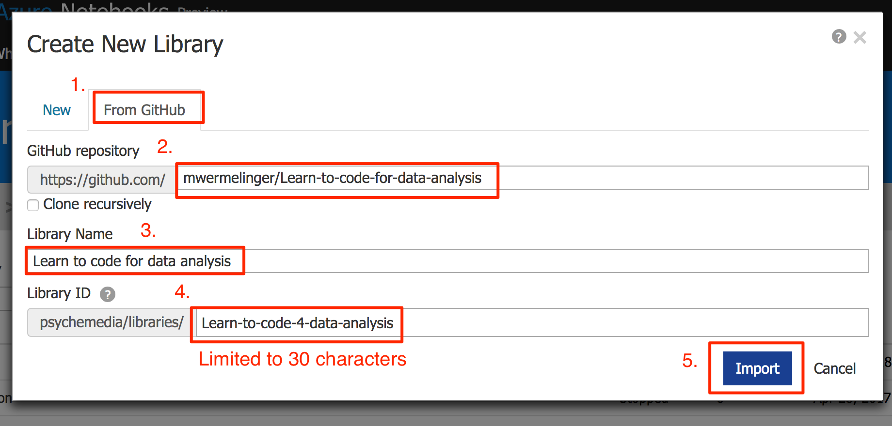
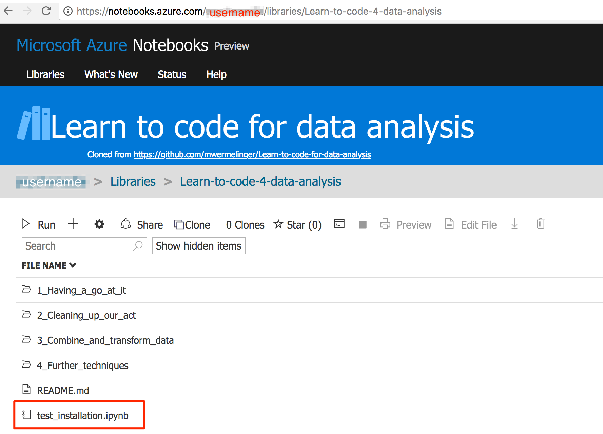
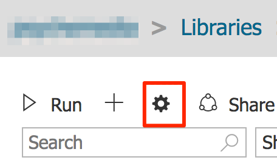
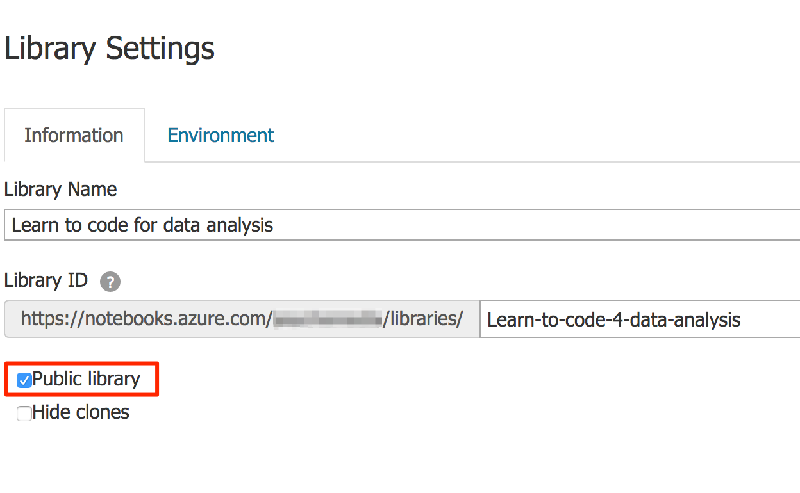

# Instructions for Microsoft Azure

The following instructions and images were created with my colleague Tony Hirst.

Go to [Microsoft Azure Notebooks](https://notebooks.azure.com/)
and click on the 'Sign In' link. 
This requires a Microsoft Live account: if you do not have one,
follow the instructions for creating a new account.

Azure allows you to organise collections of notebooks and data files
into so called libraries.
Once you're signed in, click on the + sign to create a library.

Create a new library from this Github repository (`mwermelinger/Learn-to-code-for-data-analysis`) 
by filling the dialog information as below. 
The choice of library name and ID are up to you. 
After you click on the 'Import' button, the process may take some time.

Once this repository's contents have been imported, 
you will be taken to the library that contains them. 
Click on the `test_installation.ipynb` link to launch the test notebook: 

When you launch the first notebook in a session, 
the notebook server may take some time to start up.
After a while the test notebook will be opened and you can work through it.

Any changes you make to the course's notebooks will be saved in your library.
You can also add new notebooks and data files to this or other libraries
you create.

By default, the library you have created will be public. 
You can change the settings by clicking on the clockwork 'settings' icon:

and then unchecking the 'Public Library' option:

